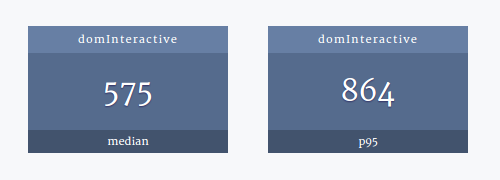

# Sweter dashboard 

Sweter dashboard aggregates web performance metrics gathered by [sweter](https://github.com/msn0/sweter). Gets key timings out of ElasticSearch and displays p95 and median.

Hold on... it's still under development.
